# GDD Manager

A desktop tool for managing Game Design Document (GDD) projects.

GDD Manager helps you organize, generate, validate, and navigate
game documentation written in Markdown.

## Features

- **Matrix view** — documents arranged by category (rows) and
  production stage (columns). Color-coded, zoomable, pannable.
- **Generator** — create a full project structure from a template
  and TOC files. Produces folders, `.md` files, and `project.json`.
- **Scanner** — validates the project: broken links, anchors,
  missing files, duplicate IDs, unknown categories, invalid JSON.
- **Search** — full-text and name search across the project folder.
- **Template editor** — manage categories, stages, and documents.
- **TOC editor** — manage the table of contents for each document.
- **Settings** — external editor integration, UI language, themes.
- **Multi-language** — UI, document names, section titles, and
  error messages are translated separately.

## Screenshots

### Main window
Documents are placed by category (rows) and production stage (columns).
Right-click a block for actions: open, copy link, rename, delete.

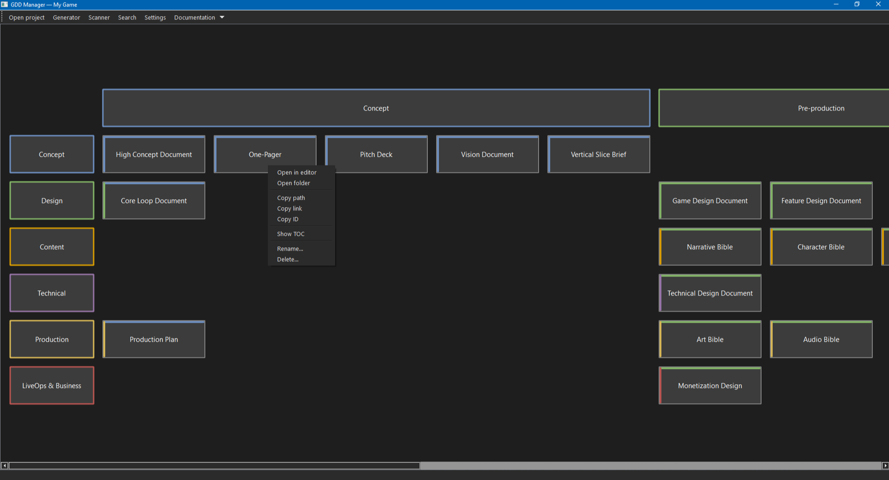

### Generator
Create a new project from a template and a set of TOC files.
Every document gets a folder, a `.md` file, and an entry in `project.json`.

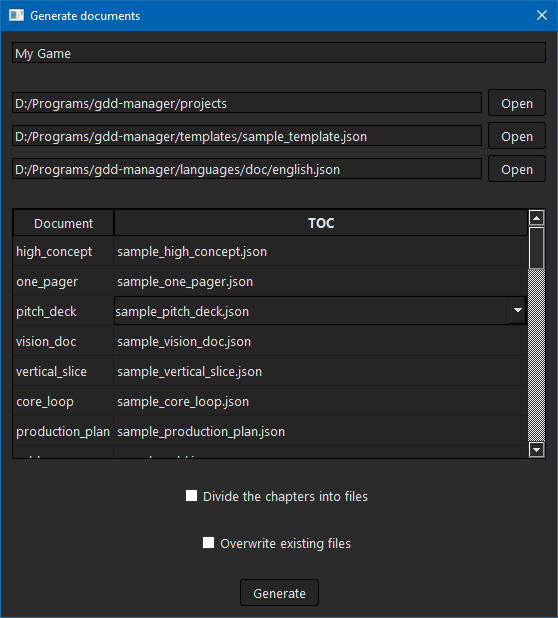

### Scanner
Validate the project: broken links, missing files, duplicate IDs,
unknown categories, invalid JSON. Double-click an issue to open
the file at the exact line.

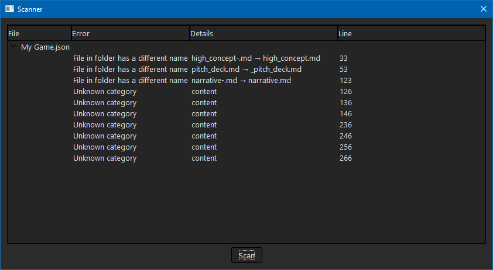

### Search
Full-text and name search across the project folder.
Results are grouped by file, with line numbers and fragments.

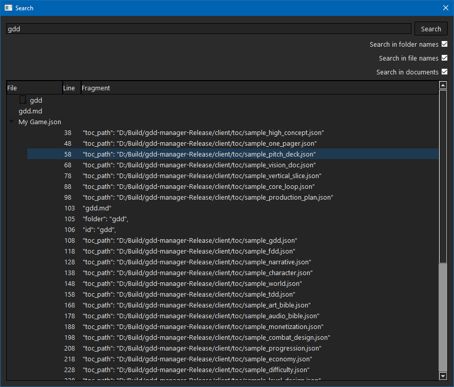

### Template editor
Manage categories, stages, and documents of a template.
Colors for categories and stages are picked visually.

#### Categories
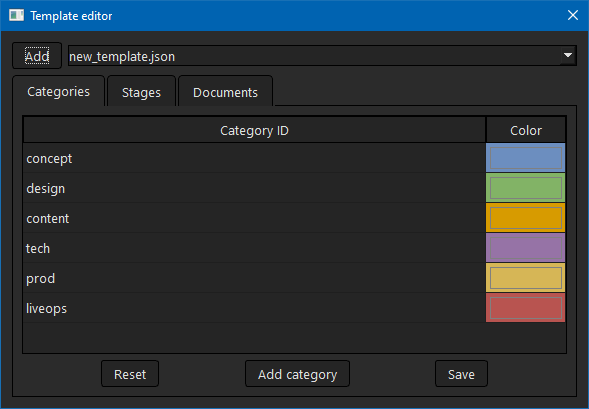

#### Stages
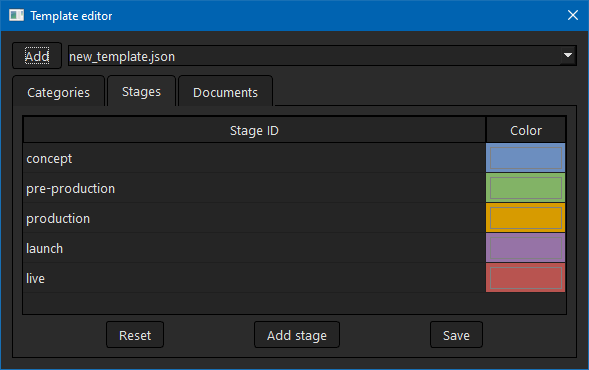

#### Documents
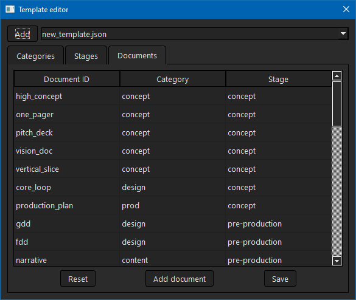

### TOC editor
Manage the table of contents for each document.
Sections are ordered and validated for duplicates.

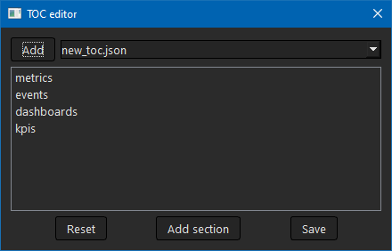

### Settings

#### Languages
Switch the UI language. Requires a restart.

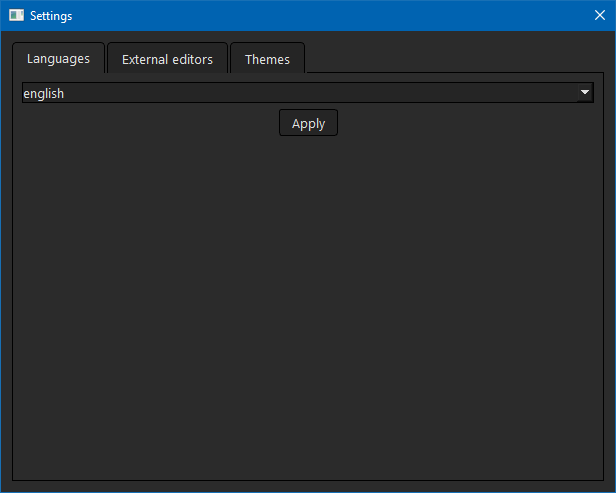

#### External editors
Configure the editor used to open `.md` files and TOC files.
The default editor is selected from the drop-down.

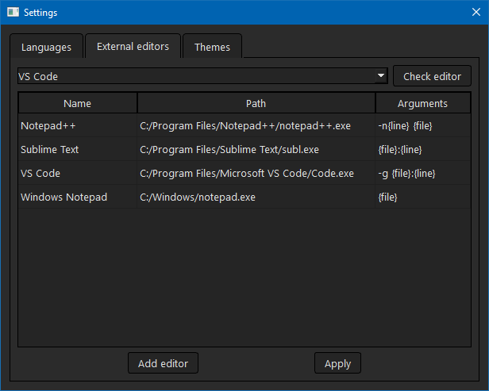

#### Themes
Choose a theme or customize colors, text sizes, and backgrounds.

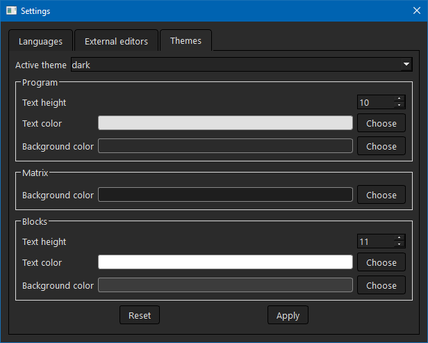

## Requirements

- Qt 6.5 or newer (Core, Widgets)
- CMake 3.19 or newer
- C++20 compiler
- Windows (primary), Linux and macOS may work
